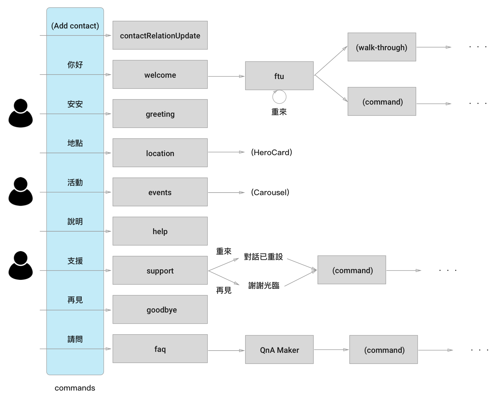

# h4bot

Hacking Thursday AI Bot is built on top of the following services:

* [Azure Bot Service][azure-bot-service]
* [Bot Builder SDK for Node.js][botbuilder]
* [Visual Studio Team Services][vsts]
* [QnA Maker API][qna-maker]

Join h4bot on [Skype][join-skype] | [Telegram][join-telegram]



[azure-bot-service]: https://azure.microsoft.com/en-us/services/bot-service/
[botbuilder]: https://docs.microsoft.com/en-us/bot-framework/nodejs/
[vsts]: https://www.visualstudio.com/team-services/
[qna-maker]: https://qnamaker.ai/
[join-skype]: https://join.skype.com/bot/7d0dabb2-0128-4bc5-b787-567a5cc34456
[join-telegram]: https://telegram.me/carl_telegram_bot

## Prerequisites

* [Bot Framework Emulator][bot-emulator]
* [Docker Community Edition 17.09.0+][docker-ce]
* Git 2.7.4+
* GNU Make 3.81

[docker-ce]: https://www.docker.com/community-edition
[bot-emulator]: https://emulator.botframework.com/

## Build and debug

* Update Git submodules by running `git submodule update --init --recursive`
* Create `secrets.env` from `secrets.env.template`
* Configure the following app settings in `secrets.env`:
  * Microsoft App ID
  * Microsoft App Password
  * QnA Knowledge Base ID
  * QnA Subscription Key
* Build h4bot Docker image: `make build`
* Start docker-compose dev server: `make start`
* Connect the bot emulator to: `http://0.0.0.0:3978/api/messages`

## Make options

```bash
make clean
make distclean
make build
make start
make stop
make yarn ARGS='config list'
```

## License

MIT

## Privacy Policy

(TBD)

## Terms of Service

(TBD)
